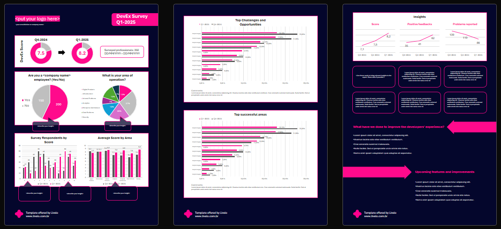
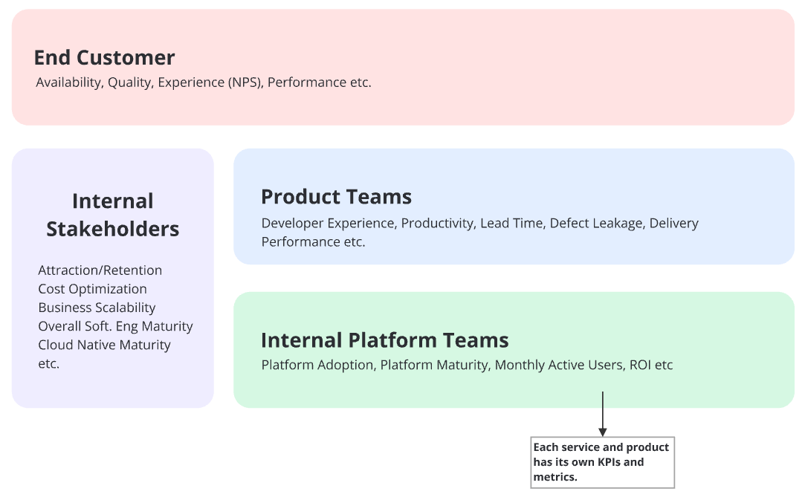

# Livelo DevEx Report Template

Welcome to the Livelo DevEx Report Template repository! This repository contains a comprehensive template designed to help you create detailed and insightful reports based on the Developer Experience (DevEx) Survey at Livelo. This template is part of our broader initiative to enhance the developer experience and drive continuous improvement within our organization.

## Table of Contents

- #introduction
- #platform-as-a-product
- #kpis
- #the-survey
- #the-report
- #final-considerations
- #license
- #contact

## Introduction

Platformization of technology is a fundamental strategy for Livelo, especially given our market segment and the digital nature of our business. A few years ago, we recognized the need to streamline and enhance our technological capabilities, leading to the establishment of our platformization strategy. As part of this initiative, we created a dedicated area called DevEx (Developer Experience). This area is focused on improving the overall experience for our developers, making their work more efficient and enjoyable.

Focusing on improving the experience for developers is fundamental to our business because we believe that a good developer experience results in higher productivity, better code quality, and consequently, better products and services for our end customers. DevEx is part of a broader division called Platform Engineering, named after the discipline of the same name that has been gaining popularity in recent years. (Read more at [CNCF Whitepapers](https://tag-app-delivery.cncf.io/whitepapersatform as a Product

Currently, the idea of treating internal development platforms as a product is recognized as an effective strategy for achieving success. The principles outlined in Team Topologies, which have been at the forefront of global discussions on platformization, strongly support this approach. (Watch the following video [Team Topologies Video](https://teamtopologies.com/videos-slides/what-is-platform-as-a-product-clues-from-team-topologiese us in managing and developing our platforms effectively, ensuring we meet stakeholder needs and drive continuous improvement. A key component of treating the platform as a product and maintaining customer centricity is defining and measuring metrics and KPIs. This approach empowers us to make more informed decisions, leading to improved outcomes and driving better results.

## KPIs

In the Platform Engineering division, we use OKRs (Objectives and Key Results) to set our quarterly objectives and track our progress. To enhance and monitor our performance, we have defined Key Performance Indicators (KPIs) using a layer-by-layer approach based on stakeholder groups. This method allows us to align with broader business objectives and provides valuable insights into whether those objectives are being met.

One of the KPIs we track is the DevEx Score, derived from our Developer Experience Survey. This score measures the satisfaction from the primary users of our technical platforms - the developers. Beyond the score itself, we gather valuable insights for continuous improvement, fostering a culture of innovation and excellence within the company.

## The Survey

Currently, we conduct the DevEx Survey quarterly. Data is gathered through a form sent to all developers (employees and third parties).

**Tips for the Survey:**
1. The form should be simple and quick to fill out.
2. The form should be anonymous, but the professional's area of operation should be identifiable.
3. Include a space for open comments, as this captures valuable insights.

After collecting the data, we utilize Generative AI to categorize qualitative responses, distinguishing between issues and compliments from the open comment section. This method enables us to transform qualitative insights into a quantitative format, facilitating ongoing analysis and tracking trends over time.

**Form Structure:**
- Are you a Livelo employee? (Yes/No)
- What is your development context? (Options: Back-end, Data, Infrastructure, Mobile, SRE, Web, or Others - with a free text field)
- What is your area of operation? (Options: Digital Products, Infrastructure, Internal Platforms, Security, Data Platform, Analytics, Enterprise Architecture - or other relevant areas within your company)
- How would you rate your software development experience in Livelo's ecosystem? (Scale: 0 to 10)
- What specific reasons influenced your rating? (Open text field for collecting qualitative information)

This structure ensures that we gather comprehensive and relevant data while keeping the form simple and quick to fill out.

## The Report
The report includes several key views: a comparison with the previous survey, the overall DevEx Score (the KPI itself), demographic data, detailed ratings, a ranking of the survey's top positive and negative items, insights, and recent advances along with items we plan to address in the coming months.

Before generating the final report, we conduct a thorough internal review of the data to ensure accuracy and completeness. Once the review is finalized, the report is distributed to stakeholders via email and communication platforms such as Microsoft Teams or Slack. Additionally, we hold sessions with interested professionals to discuss advances, problems, and opportunities. This communication is crucial as it helps us connect better with our internal customers and demonstrate results over time.

**Tips for the Report:**
1. Make the report widely accessible, especially to respondents.
2. By bringing transparency, it is possible to gain greater support and engagement from partner areas. Many complaints detected in the report require the involvement of more than one area of the company.

## Final Considerations

We are constantly seeking new technologies, methodologies, and practices to enhance our platforms and, in turn, our final products and services. This data-driven mindset keeps us ahead in the market and ensures we are always prepared to face new challenges. Additionally, by reducing cognitive load, we can positively impact developers' daily lives, helping us provide the best career experiences for our professionals.

## License

The templates in this repository are licensed under the Creative Commons BY-NC-SA 4.0 license. This means that you are free to use, modify, and share the templates, provided that you give appropriate credit, do not use them for commercial purposes, and distribute any derivative works under the same license.

For more details, please refer to the [LICENSE](../LICENSE.md) file.
